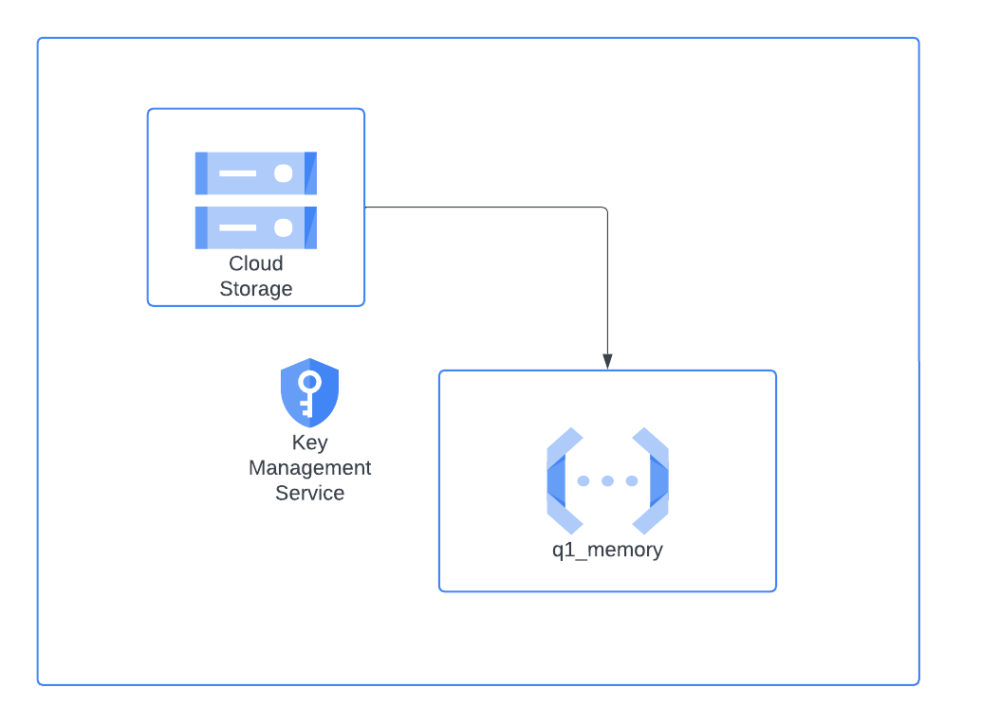

# Data Engineer Challenge
​
## Descripción General
Bienvenido al desafío para Ingenieros de Datos. En esta ocasión, tendrás la oportunidad de acercarte a parte de la realidad del rol, demostrar tus habilidades y conocimientos en procesamiento de datos con python y diferentes estructuras de datos.
​
## Instrucciones
1. Tu solución debe estar en un repositorio público de la plataforma github. 
2. Para enviar tu desafío, debes hacer un `POST` request a `https://advana-challenge-check-api-cr-k4hdbggvoq-uc.a.run.app/data-engineer`. Esto es un ejemplo del cuerpo que debes enviar:
```json
    {
      "name": "Juan Perez",
      "mail": "juan.perez@example.com",
      "github_url": "https://github.com/juanperez/latam-challenge.git"
    }
```

3. El plazo máximo de entrega del challenge son **5 días corridos completos** a partir de la recepción del challenge. Por ejemplo: Si recibiste el challenge el día jueves 21 de Septiembre a las 3 pm, tienes plazo hasta el martes 26 de septiembre a las 23:59.
3. Puedes utilizar las tecnologías y técnicas que prefieras para el procesamiento de datos. ¡Valoraremos tus conocimientos en plataformas cloud!. En tal caso, procura seguir el paso a paso en tus archivos **SIN** agregar las credenciales de acceso a los distintos servicios.
4. Los desafíos que posean un orden claro, sean explicativos, modulares, eficientes y creativos serán mejor rankeados. 
5. ¡Recuerda que no estamos en tu cabeza! Escribe los supuestos que estás asumiendo. Además, incluye las versiones de las librerías que estás usando en el archivo `requirements.txt`. Por favor, `NO BORRAR` lo que ya viene escrito en el archivo.
6. Para este desafío te recomendamos que describas claramente cómo mejorar cada parte de tu ejercicio en caso de que tenga opción de mejora.
7. Debes utilizar los datos contenidos en el [siguiente archivo](https://drive.google.com/file/d/1ig2ngoXFTxP5Pa8muXo02mDTFexZzsis/view?usp=sharing).
8. Puedes utilizar la [documentación oficial de twitter](https://developer.twitter.com/en/docs/twitter-api/v1/data-dictionary/overview/tweet-object) para entender la estructura de los datos.
9. Evaluaremos positivamente las buenas prácticas de uso de git. Tus commits, branches, pull requests. 
10. Usa la rama main para cualquier versión final que quieras que revisemos. Te recomendamos que uses alguna práctica de [GitFlow](https://www.atlassian.com/git/tutorials/comparing-workflows/gitflow-workflow). NOTA: No borres tus ramas de desarrollo.
10. Recuerda considerar el manejo de errores y casos borde.
11. Recuerda que vas a trabajar a la par con más desarrolladores, por lo que la mantenibilidad, legibilidad y escalabilidad de tu código es esencial.
12. Una buena documentación del código siempre ayuda al lector.

​
## Challenge
En el [archivo](https://drive.google.com/file/d/1ig2ngoXFTxP5Pa8muXo02mDTFexZzsis/view?usp=sharing) encontrarás un conjunto aproximado de 398MBs. Se pide resolver los siguientes problemas implementando funciones, usando **2 enfoques por cada problema**: Uno en el que se optimice el tiempo de ejecución, y otro en que se optimice la memoria en uso.

Tu desafío debe tener al menos 6 archivos python en la carpeta `src`. Cada uno de estos archivos correspondiente a la función del mismo nombre, con el mismo formato que se indica en las instrucciones de más abajo. Solo deja la función. Además de eso, debes tener un archivo `.ipynb` donde expliques con mayor claridad tu código. En este jupyter notebook puedes ejecutar tus funciones, medir el tiempo de ejecución, memoria en uso y explayarte según estimes conveniente. Te recomendamos fuertemente que utilices celdas markdown para que expliques el paso a paso de tu código.

**NOTA:** los archivos `.py` y `.ipynb` de interés ya están creados en la estructura del desafío, solo debes completarlos con tu solución y/o agregar los archivos que estimes convenientes.
​
1. Las top 10 fechas donde hay más tweets. Mencionar el usuario (username) que más publicaciones tiene por cada uno de esos días. Debe incluir las siguientes funciones:
```python
def q1_time(file_path: str) -> List[Tuple[datetime.date, str]]:
```
```python
def q1_memory(file_path: str) -> List[Tuple[datetime.date, str]]:
```
```python
Returns: 
[(datetime.date(1999, 11, 15), "LATAM321"), (datetime.date(1999, 7, 15), "LATAM_CHI"), ...]
```
​
2. Los top 10 emojis más usados con su respectivo conteo. Debe incluir las siguientes funciones:
```python
def q2_time(file_path: str) -> List[Tuple[str, int]]:
```
```python
def q2_memory(file_path: str) -> List[Tuple[str, int]]:
```
```python
Returns: 
[("✈️", 6856), ("❤️", 5876), ...]
```
3. El top 10 histórico de usuarios (username) más influyentes en función del conteo de las menciones (@) que registra cada uno de ellos. Debe incluir las siguientes funciones:
```python
def q3_time(file_path: str) -> List[Tuple[str, int]]:
```
```python
def q3_memory(file_path: str) -> List[Tuple[str, int]]:
```
```python
Returns: 
[("LATAM321", 387), ("LATAM_CHI", 129), ...]
```
​
## Sugerencias
* Para medir la memoria en uso te recomendamos [memory-profiler](https://pypi.org/project/memory-profiler/) o [memray](https://github.com/bloomberg/memray)
* Para medir el tiempo de ejecución te recomendamos [py-spy](https://github.com/benfred/py-spy) o [Python Profilers](https://docs.python.org/3/library/profile.html)


# Implementación en la Nube

Para este proyecto se usan dos ramas. La rama Master como rama principal con política se Pull Requests. Y la rama Develop como rama Fix/Feature. No se agregó revisión par ni limitaciones ya que no se estaba trabajando en conjunto.

El desarrollo en la nube inicia con la carga del archivo json con los tweets a Cloud Storage. Se usa una Cloud Function con el fin de de procesar el archivo y obtener las top 10 fechas donde hay más tweets. Mencionar el usuario (username) que más publicaciones tiene por cada uno de esos días. La Cloud function incluye una validación de esquema usando la librería pydantic.

Se implementa un pequeño pipeline de CI/CD en *.github\workflows\deploy.yaml* con el fin de mostrar el proceso de despliegue automático de una cloud function cada vez que se realiza un Merge de una rama a Master.

Las credenciales de acceso de la cuenta son manejadas mediante los secretos del sepositorio de GitHub. Esto mismo podría aplicar para el ID del proyecto u otras credenciales que no convenga tener en el Secret Manager de GCP.




## Testing

Input para la Cloud Function:
```Bash
{
    "bucket_name": "gcs-bucket-gtest-dev",
    "file_path": "tweets/farmers-protest-tweets-2021-2-4.json"
}
```

Resultado:
```json
{"top_dates":[["Fri, 12 Feb 2021 00:00:00 GMT","RanbirS00614606"],["Sat, 13 Feb 2021 00:00:00 GMT","MaanDee08215437"],["Wed, 17 Feb 2021 00:00:00 GMT","RaaJVinderkaur"],["Tue, 16 Feb 2021 00:00:00 GMT","jot__b"],["Sun, 14 Feb 2021 00:00:00 GMT","rebelpacifist"],["Thu, 18 Feb 2021 00:00:00 GMT","neetuanjle_nitu"],["Mon, 15 Feb 2021 00:00:00 GMT","jot__b"],["Sat, 20 Feb 2021 00:00:00 GMT","MangalJ23056160"],["Tue, 23 Feb 2021 00:00:00 GMT","Surrypuria"],["Fri, 19 Feb 2021 00:00:00 GMT","Preetm91"]]}
```	


Por cuestiones de tiempo se hace el ejemplo con una sola función. 
Pero esto mismo puede ser replicado para el resto de funciones. 

Bajo este mismo principio, podríamos replicar un escenario en el cual se reciba cada línea del JSON en streaming. 

Se podría usar un Tópico de Pub/Sub con el fin de generar eventos hacia Cloud functions que se encarguen de 
diferentes tareas como por ejemplo:
* Validación del esquema
* Transformación y estandarización de la data
* Carga de la data


### Repo interesante de mi autoría:

[Data Migration and Management System (Globant Challenge)](https://github.com/juand-gv/ETLwithGCP).